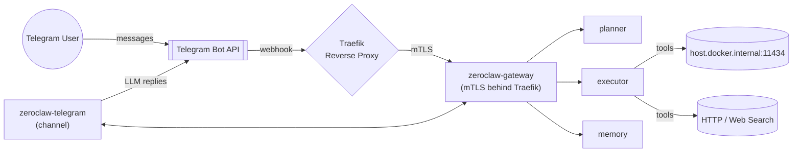

# Gentoo Stack Security & Capabilities

## Why This Setup Is Solid
- **End-to-end TLS with mutual auth:** Traefik serves the custom CA chain on :443 and only forwards traffic to `zeroclaw-gateway` after verifying client certificates, so untrusted clients never hit the core services.
- **Locked-down containers:** Every Zeroclaw service runs as UID/GID 65534 with `no-new-privileges`, `cap_drop: [ALL]`, tmpfs `/tmp`, and read-only config mounts (except the gateway state volume) to minimize lateral movement.
- **Token-protected gateway:** The paired token `zc_…0526` lives only in the writable gateway state and is required for every planner/executor/memory/channel call, so even internal services must authenticate.
- **Reverse-proxy boundary:** Only Traefik is exposed publicly; everything else stays on the internal bridge networks, keeping the attack surface tiny.

## Outbound Research Controls
- `http_request` and `web_search` are enabled across gateway, planner, executor, memory, and telegram-channel so Gentoo can browse, cite sources, and fetch slickdeals/AI intel when needed.
- Each call is capped to a 2 MB response (`max_response_size = 2_097_152`) with a 60 s timeout, and searches are limited to 5 DuckDuckGo results. This keeps bandwidth predictable and prevents runaway scraping.
- Domains are currently unrestricted (`allowed_domains = ["*"]`); if you ever need to lock it down, you can swap that list for specific hosts.

## Data Residency & Persona
- Workspaces for each service stay under `state/*/workspace`, and the custom persona in `state/telegram/workspace/IDENTITY.md` defines Gentoo’s mission, tone, and privacy guardrails.
- Memory is backed by SQLite inside the containers, so nothing leaves the host unless you explicitly export it.

## Flow Diagram

## Explainer
1. **Telegram user → Traefik:** Webhook traffic lands on Traefik (:443) where mTLS is enforced. Only valid client certs get routed onward.
2. **Traefik → Gateway:** Requests are forwarded over the internal `zeroclaw_edge` network to `zeroclaw-gateway`, which validates the bearer token before doing anything.
3. **Gateway orchestration:** The gateway fans requests out to planner, executor, and memory over the internal bridge with mutual trust already established.
4. **Tooling:** When Gentoo needs fresh intel, executor calls Ollama on `host.docker.internal:11434` for reasoning and uses the enabled HTTP/Search tools for live data, all under the configured size/time caps.
5. **Response:** Results flow back through the gateway to the telegram-channel container, which replies via the Telegram Bot API.

## Observability
- All Zeroclaw services now expose Prometheus metrics by setting `[observability] backend = "prometheus"`; Traefik serves its own `/metrics` endpoint on port 9100 with entrypoint/service labels enabled.
- A standalone project at `c:/Users/charl/projects/observability-stack` runs Prometheus (9090) and Grafana (3001) on Docker Desktop, attaching to the secure-stack network so it can scrape gateway/planner/executor/memory and Traefik directly. Swap its external network if another publisher wants to reuse the stack.
- Grafana auto-loads the "ZeroClaw Performance" dashboard showing Traefik latency (P95), request rates, and scrape status. Use it to visualize Telegram-driven workload or alert on regressions before production.

With this architecture you get audited external access, hardened containers, tightly scoped outbound tooling, and full telemetry ready for Grafana demos.
